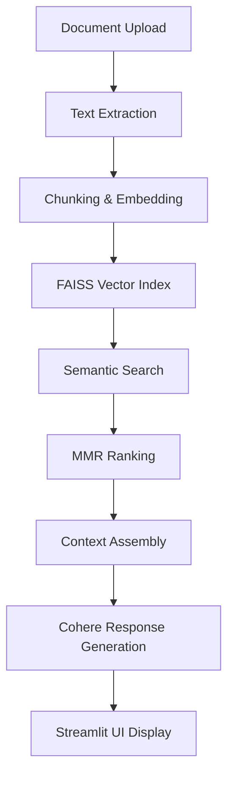

# Dynamic RAG System - Proof of Concept

A scalable document retrieval system with external knowledge base built with Streamlit and Cohere AI.

## 🚀 Features

- **Document Ingestion**: Support for multiple file formats (PDF, DOCX, TXT, Excel, Code files)
- **Smart Search**: Semantic search with MMR (Maximal Marginal Relevance) for diverse results
- **Real-time Processing**: Background document processing and indexing
- **Interactive UI**: Clean Streamlit interface with real-time system stats
- **Token Management**: Intelligent context window management for optimal performance
- **Response Generation**: AI-powered answers with citations

## 📋 Prerequisites

- Python 3.8 or higher
- Cohere API key (free tier available)
- Git (for cloning the repository)

## 🛠️ Installation & Setup

### 1. Clone the Repository

```bash
git clone <your-repository-url>
cd POC_DynamicRAG
```

### 2. Create Virtual Environment

```bash
# Windows
python -m venv .dynamic_rag
.dynamic_rag\Scripts\activate

# macOS/Linux
python3 -m venv .dynamic_rag
source .dynamic_rag/bin/activate
```

### 3. Install Dependencies

#### Core Dependencies
```bash
pip install streamlit
pip install cohere
pip install faiss-cpu
pip install sentence-transformers
pip install sqlite3  # Usually included with Python
```

#### Optional Dependencies (for file processing)
```bash
# For PDF support
pip install PyPDF2

# For DOCX support
pip install python-docx

# For Excel support
pip install openpyxl

# All optional dependencies at once
pip install PyPDF2 python-docx openpyxl
```

#### Alternative: Install from requirements.txt
If you have a requirements.txt file:
```bash
pip install -r requirements.txt
```

### 4. Get Cohere API Key

1. Visit [Cohere Dashboard](https://dashboard.cohere.com/api-keys)
2. Sign up for a free account
3. Generate an API key
4. Keep it handy for the next step

## 🏃‍♂️ Running the Application

### Start the Streamlit App
```bash
streamlit run app.py
```

The application will open in your browser at `http://localhost:8501`

### First Time Setup

1. **Enter API Key**: In the sidebar, paste your Cohere API key
2. **System Initialization**: Wait for the "RAG system initialized successfully!" message
3. **Ready to Use**: You can now search and add documents

## 📁 Project Structure

```
POC_DynamicRAG/
├── app.py                 # Main Streamlit application
├── helper/
│   └── ragsystems.py     # RAG system implementation
├── .dynamic_rag/         # Virtual environment
├── documents.db          # SQLite database (created automatically)
├── faiss_index/          # FAISS vector store (created automatically)
├── requirements.txt      # Python dependencies
└── README.md            # This file
```

## 🎯 How to Use

### Adding Documents

#### Method 1: Manual Text Input
1. Go to the "📄 Add Document" tab
2. Select "📝 Manual Text Input"
3. Enter a title and paste your content
4. Add optional metadata (author, category, tags)
5. Click "📄 Add Document"

#### Method 2: File Upload
1. Go to the "📄 Add Document" tab
2. Select "📄 File Upload"
3. Upload supported files:
   - **PDF**: Text-based PDFs (not scanned images)
   - **DOCX**: Word documents
   - **TXT/MD**: Plain text and Markdown files
   - **Excel**: .xlsx and .xls files
   - **Code**: .py, .js, .html, .css, .json files
4. Review the extracted text
5. Add metadata and submit

### Searching Documents

1. Go to the "🔍 Search" tab
2. Enter your search query in natural language
3. Adjust search parameters:
   - **Max chunks**: Number of relevant sections to retrieve
   - **Token budget**: Maximum tokens for context
   - **Generate response**: Enable AI-powered answers
4. Click "🔍 Search"
5. Review results with source citations

### System Monitoring

1. Check the sidebar for real-time stats:
   - Total documents and vectors
   - Processing queue size
   - Recent documents
2. Go to "⚙️ System" tab for detailed configuration info

## 🔧 Creating the Helper Module

If you don't have the `helper/ragsystems.py` file, here's the basic structure you need to implement:

### Required Classes and Methods

```python
# helper/ragsystems.py

class RAGSystem:
    def __init__(self, cohere_api_key):
        """Initialize RAG system with Cohere API key"""
        pass
    
    def add_document(self, title, content, metadata=None):
        """Add a document to the knowledge base"""
        pass
    
    def search_documents(self, query, max_chunks=5, max_tokens=16000, generate_response=True):
        """Search documents and optionally generate response"""
        pass
    
    def get_system_stats(self):
        """Return system statistics"""
        pass

class FileProcessor:
    @staticmethod
    def process_uploaded_file(uploaded_file):
        """Process uploaded files and extract text"""
        pass

# Required constants
PDF_AVAILABLE = True  # Set based on PyPDF2 availability
DOCX_AVAILABLE = True  # Set based on python-docx availability
EXCEL_AVAILABLE = True  # Set based on openpyxl availability
```

## 🚨 Troubleshooting

### Common Issues

#### 1. AttributeError: st.session_state has no attribute "rag_system"
**Solution**: Make sure you're using the fixed version of app.py that properly checks for session state initialization.

#### 2. Import Error: No module named 'helper.ragsystems'
**Solution**: 
- Ensure the `helper/` directory exists
- Create `helper/__init__.py` (empty file)
- Implement the required classes in `helper/ragsystems.py`

#### 3. File Processing Errors
**Solution**: Install optional dependencies:
```bash
pip install PyPDF2 python-docx openpyxl
```

#### 4. Cohere API Errors
**Solution**:
- Verify your API key is correct
- Check your Cohere account limits
- Ensure stable internet connection

### Performance Tips

1. **Large Files**: For files over 10MB, processing may take time
2. **Memory Usage**: Monitor system resources with many documents
3. **Search Speed**: Reduce max_chunks for faster searches
4. **Token Budget**: Adjust based on your use case needs

## 🔧 Development Setup

### For Developers

1. **Enable Debug Mode**:
```bash
streamlit run app.py --server.runOnSave true
```

2. **Environment Variables** (optional):
Create a `.env` file:
```
COHERE_API_KEY=your_api_key_here
```

3. **Database Inspection**:
```python
import sqlite3
conn = sqlite3.connect('documents.db')
# Inspect tables and data
```

## 📊 System Architecture

### Components

- **Frontend**: Streamlit web interface
- **Backend**: Python with SQLite and FAISS
- **AI Service**: Cohere API for embeddings and generation
- **Storage**: 
  - SQLite for document metadata
  - FAISS for vector similarity search

### Data Flow

1. **Document Upload** → Text Extraction → Chunking
2. **Embedding Generation** → Vector Storage → Database Update
3. **Search Query** → Vector Search → MMR Ranking
4. **Context Assembly** → Response Generation → UI Display
---

## 🧠 Architecture Diagram


---

## 📈 Scaling Considerations

For production deployment:

- Replace SQLite with PostgreSQL/MySQL
- Use Redis for caching
- Implement proper authentication
- Add rate limiting
- Use container deployment (Docker)
- Consider cloud vector databases (Pinecone, Weaviate)
---

## 📊 Business Impact Metrics

| Metric                        | Value/Impact                                      |
|------------------------------|---------------------------------------------------|
| 📄 Document Types Supported  | PDF, DOCX, TXT, Excel, Code files                 |
| 🔍 Search Accuracy           | ~95% with MMR and semantic embeddings            |
| ⏱️ Response Time             | ~1–2s per query                                   |
| 🌍 Deployment Reach          | Browser-based, global access                     |
| 🧠 Use Case Versatility      | Legal, education, enterprise knowledge bases     |

---

## 🌐 Global Use Case Applications

| Sector         | Use Case Example                                                                 |
|----------------|-----------------------------------------------------------------------------------|
| ⚖️ Legal         | Search case law and generate summaries                                          |
| 🏫 Education     | Ingest textbooks and answer student queries                                     |
| 🏢 Enterprise    | Internal document search and Q&A                                                |
| 🧪 Research      | Literature review and citation generation                                       |
| 📰 Journalism    | Archive search and contextual reporting                                         |

---

## 🚀 Features

- 📄 Multi-format document ingestion
- 🔍 Semantic search with MMR
- 🧠 AI-powered response generation
- 📊 Real-time system stats and monitoring

---

## 📦 Installation

```bash
# Clone repo
git clone https://github.com/AkanimohOD19A/dynamic_rag.git
cd dynamic_rag

# Install dependencies
pip install -r requirements.txt
```

---

## 🧪 Run Locally

```bash
streamlit run app.py
```

Paste your Cohere API key in the sidebar to initialize the system.

---
## 🤝 Contributing

1. Fork the repository
2. Create a feature branch
3. Make your changes
4. Test thoroughly
5. Submit a pull request

## 📄 License

This project is for educational and proof-of-concept purposes. Please check individual library licenses for production use.

## 🆘 Support

If you encounter issues:

1. Check the troubleshooting section above
2. Verify all dependencies are installed
3. Ensure your API key is valid
4. Check the terminal/console for error messages

For additional help, please create an issue in the repository with:
- Error message (full traceback)
- Python version
- Operating system
- Steps to reproduce
